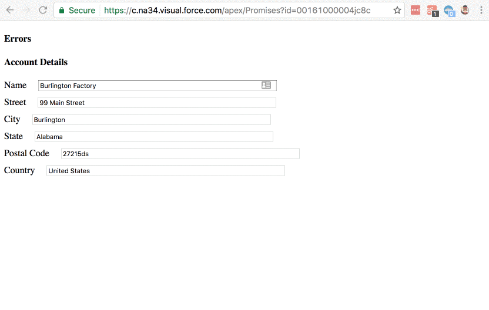

# vf-react-onblur-save

This is a simple page and React app that lets a user bounce around a form, and when moving inputs, will try to save their work to the server. In this example, when the user blurs from an input, a call is made to the a remote action method with the Account record. If there is an error, the inputs are disabled and the error is displayed for the user; otherwise, nothing happens and the user may continue.

## Demo GIF


## Package Installatio
If you're interested in playing around with this page, it would be best to fork this repo and start working with the files in `/dev/js/`. You can run the following commands when in the repo's root folder to get started.

```
npm install
webpack --watch
```

Then as you make changes to your files in `/dev/`, you'll see them compiled into `promises.resource/js/app.js`, and can use MavensMate to deploy the resource bundle.